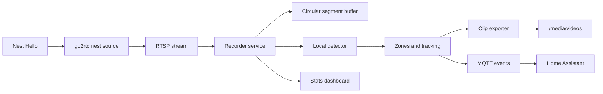

# Nest AI Recorder

Local recording and detection pipeline for Google Nest cameras exposed through
go2rtc, designed as a Home Assistant-friendly project rather than a collection
of loose scripts.

The repo now contains the full phased foundation:

- Phase 1: RTSP segment recorder, circular buffer utilities, config loading.
- Phase 2: YOLO adapter, motion scoring, zone filtering, lightweight tracking.
- Phase 3: pre/post event segment selection and ffmpeg MP4 concat export.
- Phase 4: MQTT payload generation, Docker, HA add-on scaffold, HA integration.
- Phase 5: JSON stats store, simple dashboard, tests, and docs.

## Architecture



## Quick Start

1. Copy `config/config.example.yaml` to `config/config.yaml`.
2. Set your go2rtc RTSP URL.
3. Start the service:

```powershell
docker compose up --build
```

The default container command is `nest-ai-recorder serve`. For recorder-only
operation, run `nest-ai-recorder run`.

## Detection

Detection is optional. Set `detection.enabled: true` and install the `ai` extra
inside your runtime image to use Ultralytics YOLO and OpenCV. The pure event,
zone, tracking, MQTT, and clip logic is tested without requiring those heavy
packages locally.

## Dashboard

When enabled, the built-in dashboard listens on port `8099` and exposes:

- `/` for a lightweight stats page.
- `/api/stats` for raw JSON.

## Project Layout

- `src/nest_ai_recorder`: recorder, detection, event pipeline, MQTT, dashboard.
- `custom_components/nest_ai_recorder`: Home Assistant custom integration.
- `addon`: Home Assistant OS add-on packaging.
- `config`: example recorder configuration.
- `docs`: installation, API, MQTT, troubleshooting.
- `tests`: focused unit tests for core behavior.
