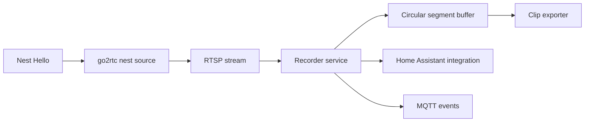

# Nest AI Recorder

Local recording and detection pipeline for Google Nest cameras exposed through
go2rtc, designed to become a polished Home Assistant integration instead of a
bag of scripts.

This repository is being built in phases. Phase 1 provides the recorder
foundation: configuration loading, ffmpeg segment rotation, circular buffer
selection, clip planning, Docker packaging, Home Assistant custom integration
scaffolding, and tests.

## Architecture



## Quick Start

1. Copy `config/config.example.yaml` to `config/config.yaml`.
2. Set your go2rtc RTSP URL.
3. Run the recorder:

```powershell
docker compose up --build
```

Clips are written below `/media/videos` by default, grouped by month and day.

## Project Layout

- `src/nest_ai_recorder`: recorder library and CLI.
- `custom_components/nest_ai_recorder`: Home Assistant custom integration.
- `addon`: Home Assistant OS add-on packaging.
- `config`: example recorder configuration.
- `docs`: installation, API, MQTT, troubleshooting.
- `tests`: focused unit tests for segment planning and deduplication.

## Roadmap

- Phase 2: YOLO object detection, motion gating, ByteTrack, ignore zones.
- Phase 3: 10 second pre-buffer and 50 second post-buffer clip export.
- Phase 4: native MQTT/Home Assistant events, HA OS add-on hardening.
- Phase 5: dashboard, statistics, integration tests, full documentation.

